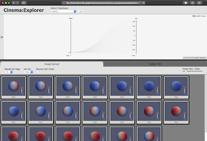

<!--
    $size: 16:9
    $theme: default
    page_number: true
    footer: Spreadsheet Example 2020 
-->
<!-- *footer: -->
<!-- *page_number: -->
<link rel="stylesheet" type="text/css" href="css/ecp.css"></link>


# Cinema Spreadsheet Example
## Online Tutorial, 10 March 2020

David Rogers, James Ahrens, Terry Turton, Soumya Dutta,
Divya Banesh, Roxana Bujack, Ethan Stam

<small>LA-UR-19-31442</small>


---


# Goals for this example

<!-- TODO update image to montage -->


- **Introduce Cinema**
    - Provide some basic Cinema concepts
- **Examples**
	- Understand and inspect examples of Cinema databases 
        - a fully-populated database
        - a sparse database
- **Further Information**
	- Pointers to more tutorials and instructions

---

# Introduce Cinema 

---

# What is Cinema?


Cinema is a data exploration ecosystem designed to help explore extreme scale data. The ecosystem consist of:

- database specification,
- database writers
- database viewers
- algorithms


---

# Important Cinema Terms

- **Cinema database:** a set of data in permanent storage, as described by the Cinema Specification, consisting of **artifacts** and parameters.

- **Artifact (Extract):** a logical collection of data in permanent storage
    - example: a set of images
    - example: a set of graphs
    - example: a simulation grid
    - example: `.vti` file

---

# Digging into Cinema Databases


A Cinema database is a set of artifacts, parameters and semantics. The [Cinema Specification](https://github.com/cinemascience/cinema/blob/master/specs/dietrich/01/cinema_specD_v012.pdf) contains detailed information, and:

- Describes the format (csv), and a minimal set of restrictions on the data.
- Describes a set of artifacts, and parameters associated with those files.

---

# Examples 

---

# A set of Cinema 'spreadsheet' examples 

These examples are based on our interactions with scientists. We have found that scientists keep spreadsheets of parameter/artifact mappings for complex data from experiments. The parameters can include things like experiment settings, results from measurements, etc. The artifacts can be such things as graphs, etc.

These can be explored using cinema databases and viewers.

First, we'll start with a simple, smoothly varying example and move to this more complex use case, which has much messier data.

---


# A simple example of a Cinema Database

In `example` directory, we'll start with the `small` example. First we'll examine the database, then the Cinema viewer installed alongside it. This is a file-based example (using a web browser, but only working on local files).

This directory has the following contents:

```
example/
    small/
        cinema/          (cinema files needed by the viewer)
        cinema_view.html (a browser-based viewer file)
        example.cdb/     (a simple example cinema database)
```
---


# The Cinema Database 

No matter how complex, all Cinema databases have the same elements.
- a `<name>.cdb` directory containing:
- a `data.csv` file
- optional artifact files

The `data.csv` file maps parameters to data artifacts. In this example, it maps a single parameter (amplitude) to an image. The file's contents look like this:

```
amplitude,FILE
0.0,plot_001.png
0.1,plot_002.png
0.2,plot_003.png
0.3,plot_004.png
...
```

---


# A note about Cinema Viewers and browser permissions

When Cinema viewers are used on local files, browsers can restrict access to local files. To change this, set the following options for your browser (Firefox and Chrome are Cinema's officially supported browsers, though others may work as well):

- Firefox (setting depends upon version of Firefox)
    - In address bar, input **about:config:**
		- set **privacy.file_unique_origin** to **false**
        - set *security.fileuri.strict_origin_policy* to **false**
- Chrome (exit Chrome)
    - use --disable-web-security command line option for this session
    - `open_chrome` file in this example shows how to do this from the command line for Mac 


---


# A database and a Cinema Viewer 


We can now use a viewer to look at the database, either through `File->Open` or pasting the file location into the browser's navigation bar. 

In this example, we are using `Cinema:View`, which is used to view simple databases.`Cinema:View` has three types of controls:

1. A database selector widget
2. An `Image Size` control
3. A slider for each parameter in the database
---


# Types of databases `Cinema:View` can view


`Cinema:View` is intended to work with image databases that are *fully populated*. This means that every combinations of sliders is mapped to a data artifact. This is a very common use case, especially for databases exported from applications such as ParaView.

---


# Creating a database from a spreadsheet 

The next example is for messier data, as described in the first slide. 

We have found that scientists keep spreadsheets of parameter/artifact mappings for complex data from experiments. The parameters can include things like experiment settings, results from measurements, etc. The artifacts can be such things as graphs, etc. 

These can easily be converted to a Cinema database by exporting the spreadsheet to a `.csv` file, and creating a Cinema database as in the above examples.

However, because the data can be messier (missing, not fully populated), we need to use a different viewer.

---


# A messier example of a Cinema Database

In `example` directory, look at the `big` example. This contains a database that is sparse (has missing values), and not fully populated (does not have every possible combination of parameter values.

This directory has the following contents:

```
example/
    big/
        cinema/              (cinema files needed by the viewer)
        cinema_explorer.html (a browser-based viewer file)
        experiment_big.cdb/  (a simple example cinema database)
```
---


# The `data.csv` file  

The `data.csv` file included in this example is sparse and not fully populated:

```
a,b,c,d,e,f,g,h,i,j,FILE
12.55,35.0,,,24.0,23.0,37.0,102.5,4.87,-33.0,plot_001.png
11.35,8.0,2.5,7.0,42.4,46.0,40.0,12.5,9.46,14.0,plot_002.png
12.4,48.0,,82.0,,36.0,89.0,5.0,6.22,-5.0,plot_003.png
...
```
---


# Viewing a Cinema database with `Cinema:Explorer` 


We use `Cinema:Explorer` to view databases like this. This viewer is designed to explore the entire Cinema database at the same time, allowing the user to select ranges of variables in the parallel coordinates viewer at the top. Artifacts that match the query are displayed in the lower widget.


---

# Further Information  

---

# Exploring examples


Looking at other examples can help you understand more about how viewers and databases can be used. There are several examples included in this tutorial, and they are avialable online as well:

- Open `tutorial.html`
- [Online examples](https://cinemascience.org/cinema_examples/online-examples/tutorial.html) 

---

# Cinema Viewers


`cinemascience` github organization includes several viewer repositories

- **Cinema:Components**, reusable browser-based components for viewers.
- **Cinema:View**, a basic viewer to explore one or more databases.
- **Cinema:Explorer**, a more full-featured viewer to explore databases.
- **Cinema:Scope**, a cross-platform viewer application under development.

---

# Cinema Viewers


Viewers and components can be used in a variety of ways:

- Small files saved along with Cinema databases
	- Useful when web access is restricted
    - Requires no infrastructure support
        - Ease of support
        - Long shelf life
- Online, through web server
	- Common use case
    - Cinema will be supported natively on ECP Concur

---

# Viewer `Cinema:View`

Browser-based basic viewer for image-based output

- Basic viewer, can be easily edited to view multiple databases
- Sliders control all windows
- `Cinema:View` will do its best to show images as the parameters are manipulated (missing images will not cause problems).

---

# Viewer `Cinema:Explorer`

Browser-based Explorer for general databases

---

# Online Resources

- This Tutorial
    - http://cinemascience.org/tutorials/2019-11_SC
    - https://github.com/cinemascience/cinema_tutorial_2019-11_SC
- Cinema github
    - https://github.com/cinemascience
- Cinema websites
    - http://www.cinemascience.org
    - http://www.cinemaviewer.org
- Cinema Examples
    - http://portal.nersc.gov/project/alpine/2018_ECPReview_Cinema/review.new.html

---

# Cinema Website


- Examples (videos)
- Links to code repositories
- Links to expanded documentation

---

# Cinema Website Documentation


- Summarized code examples
- Third party partner instructions
	- ParaView
	- VisIt
- Example datasets

---

# Cinema Github Repositories


- `cinemascience` group
- All public released and in-progress code
	- See individual projects for status

---

# Cinema Examples


- ECP app examples for 2018 review
- View of ongoing workflow development for ECP app analysis and tasks

---

# Acknowledgements

- Slides created with [`Marp`](https://yhatt.github.io/marp)

- Nyx cosmology simulation code:
 A. S. Almgren, J. B. Bell, M.J. Lijewski, Z. Lukic, E. Van Andel, "Nyx: A Massively Parallel AMR Code for Computational Cosmology" Astrophysical Journal, 765, 39, 2013.  https://amrex-astro.github.io/Nyx/
